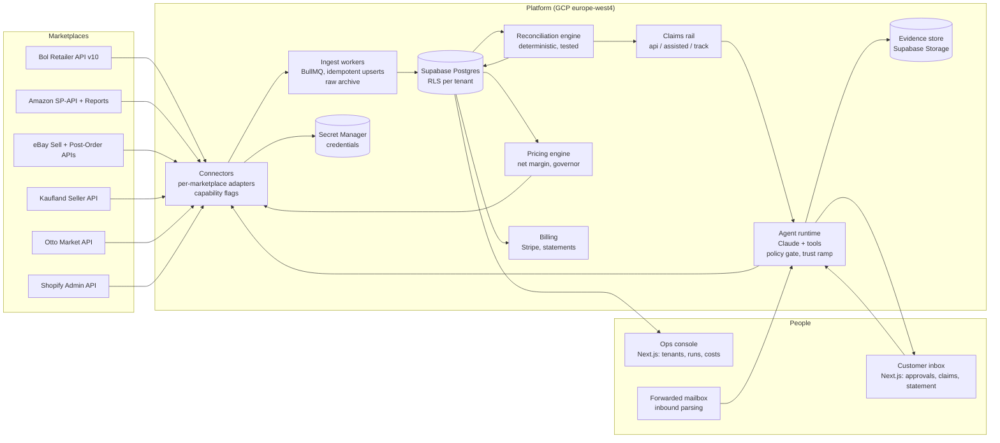
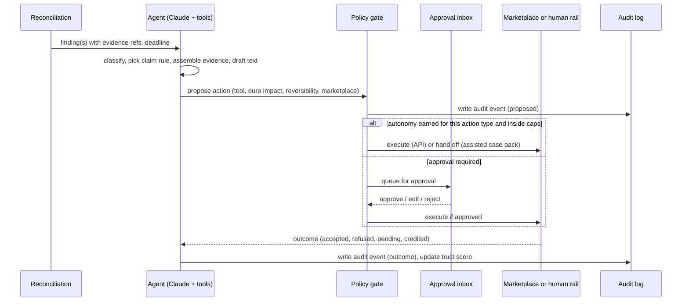

# Seen: MVP architecture

The technical design the tickets in `docs/tickets/` implement. Read with [the PRD](prd/prd.md) (what and why) and [the development plan](development-plan.md) (when and in what order). Diagrams are Mermaid and render on GitHub.

## Principles

Seven rules the whole build follows. API-native only: every marketplace action goes through an official API or is handed to a human as a prepared one-click submission; no browser automation, because eBay's licence agreement and Amazon's policies forbid it and because a scraper is the one thing a marketplace can switch off. Everything is an event on the trade record: orders, shipments, returns, settlement lines, findings, claims, credits, price changes and messages are rows keyed to one tenant, one marketplace and one external id, never state hidden in a job. Deterministic code reconciles, the model reasons: matching, fee expectation and euro arithmetic are code with tests; classification, evidence assembly, claim drafting, correspondence and exception handling are the model behind tools. Every action passes one policy gate: each tool declares its marketplace, reversibility, euro impact and action type, and the gate decides autonomous, approval or refuse from caps and the trust ramp. Append-only audit: agent runs, tool calls, approvals and outcomes are written before the side effect, never after. One tenant, one boundary: Postgres row-level security by tenant, credentials in Secret Manager per connection, EU region, delete on request. Measure what we bill: a credit is billable only when it appears in an ingested settlement line and links to a claim; headroom captured is counted from ingested orders; the meter and the ledger are the same table.

## Capability routing per marketplace

What the research established today about official APIs, and therefore how each agent capability is routed. "API" means the agent acts end to end; "assisted" means the agent prepares text, evidence and a deep link and a human submits in one click, after which the agent tracks the outcome; "none" means out of scope for the MVP.

| Capability | Bol | Amazon (SP-API) | eBay | Kaufland | Otto | Shopify |
|---|---|---|---|---|---|---|
| Ingest orders, shipments, returns | API | API (Orders, Reports) | API (Fulfillment, Post-Order) | API | API | API (truth for stock, product) |
| Ingest settlements, fees, invoices | API (Invoices + specifications, Commissions per EAN) | API (settlement, reimbursement, returns and fee reports; Finances) | API (Finances: transactions, payouts) | API (reports, invoices; settlement detail to verify) | API (receipts) | API (Shopify Payments payouts) |
| Detect fee errors, lost shipments, return shortfalls | code on ingested data | code on ingested data | code on ingested data | code | code | n/a |
| File claims with evidence | assisted (partner platform form; no API) | assisted (Seller Central case; no API, confirmed by Amazon) | API (payment disputes: contest, add evidence; Post-Order cases) | API (tickets) | assisted | n/a |
| Track claim outcome to credit | API (credit appears in invoice specification) plus inbound mail | API (reimbursement and settlement reports) plus inbound mail | API (dispute status, Finances) | API (tickets) | API (receipts) | n/a |
| Fix listings and content | API (Offers, Product Content) | API (Listings Items, Feeds) | API (Inventory, Feed; Trading compatibility for fitment) | API | API | API |
| Buyer messages and correspondence | none by API (assisted via inbox) | API (Messaging, Solicitations) | API (Trading messaging, verify deprecation) | API (tickets) | API (messaging) | n/a |
| Competing offers and price changes | API (Competing Offers by EAN, Offers) | API (Product Pricing incl. featured-offer expected price) | API (Browse by GTIN; Inventory) | API (virtual buy box, verify) | none found | own price only |
| Sponsored placements | API (Advertising API, separate access) | API (Amazon Ads API, separate approval) | API (Marketing: Promoted Listings) | none found | none found | n/a |

Consequences for the design: the claims rail is the only capability that fragments, so it is built as one abstraction with three modes and eBay is the first marketplace where the full loop runs by API; Bol is the only marketplace with no messaging API, so its correspondence runs through the tenant's forwarded mailbox; Amazon's developer registration, role approval and the Ads API application are the long poles and are filed on day 0.

## System context



## Services

The monorepo (pnpm, turborepo) has three deployables on Cloud Run and one database. `apps/api` is NestJS: REST for the console, webhooks (Shopify, Stripe, Postmark inbound, marketplace push notifications where offered), and the job producers. `apps/worker` is NestJS with BullMQ on Memorystore Redis: one queue per connector and per stage (ingest, reconcile, claims, agent, pricing, billing), per-tenant job keys, idempotent handlers, exponential backoff that respects each marketplace's rate-limit headers. `apps/web` is Next.js: the customer inbox and the ops console, Supabase Auth, server components reading Postgres through RLS. `packages/core` holds the domain: the trade-record schema, the reconciliation engine as pure functions, fee schedules per marketplace and category, claim templates, the policy gate. `packages/connectors` holds one adapter per marketplace behind a shared interface with a capability matrix. `packages/agent` holds tool definitions, prompts, run orchestration and cost accounting. Cloud Scheduler triggers sync cadences (orders hourly, settlements daily, competing offers on a tiered clock), Secret Manager holds every credential, Cloud Storage or Supabase Storage holds raw payloads and evidence, OpenTelemetry ships traces and per-tenant cost to Cloud Logging.

## Trade record (data model)

```mermaid
erDiagram
  TENANT ||--o{ CONNECTION : has
  TENANT ||--o{ PRODUCT : owns
  CONNECTION }o--|| MARKETPLACE : to
  PRODUCT ||--o{ LISTING : listed_as
  LISTING }o--|| CONNECTION : on
  CONNECTION ||--o{ ORDER : receives
  ORDER ||--o{ ORDER_LINE : contains
  ORDER ||--o{ SHIPMENT : ships
  ORDER ||--o{ RETURN : returns
  CONNECTION ||--o{ SETTLEMENT : pays
  SETTLEMENT ||--o{ SETTLEMENT_LINE : itemises
  SETTLEMENT_LINE }o--o| ORDER_LINE : refers
  ORDER_LINE ||--o{ FEE_EXPECTATION : should_cost
  SETTLEMENT_LINE ||--o{ FINDING : raises
  SHIPMENT ||--o{ FINDING : raises
  RETURN ||--o{ FINDING : raises
  FINDING }o--|| CLAIM : grouped_into
  CLAIM ||--o{ CLAIM_EVENT : history
  CLAIM ||--o{ EVIDENCE : supported_by
  CLAIM }o--o| SETTLEMENT_LINE : credited_by
  CONNECTION ||--o{ MESSAGE_THREAD : correspondence
  TENANT ||--o{ POLICY : governs
  AGENT_RUN ||--o{ AGENT_ACTION : performs
  AGENT_ACTION }o--o| APPROVAL : gated_by
  AGENT_ACTION ||--|| AUDIT_EVENT : logged_as
  LISTING ||--o{ COMPETITOR_SNAPSHOT : observed
  LISTING ||--o{ PRICE_CHANGE : repriced
  PRICE_CHANGE ||--o{ HEADROOM_ENTRY : counted_as
  TENANT ||--o{ INVOICE : billed
  INVOICE }o--o{ CLAIM : recovery_share
```

Tables and the fields that matter. `tenants`, `users`, `connections` (marketplace, country, credential ref, scopes, status, last_sync per stream). `marketplaces` is a static catalogue carrying the capability flags and fee schedules. `products` (sku, ean/gtin, cost layers with effective dates for the net-margin model), `listings` (connection, external offer id, price, stock, content hash, spec issues, fitment coverage for parts). `orders`, `order_lines`, `shipments` (carrier, tracking, delivered/lost status), `returns` (rma, condition, handling result, compensation expected). `settlements` (payout or invoice header, period, currency, totals, document refs), `settlement_lines` (typed: commission, fixed fee, ad charge, refund, adjustment, compensation, correction; amount; external ref; matched order_line). `fee_expectations` (per order line: expected commission, fixed fee and ad cost from the marketplace fee schedule and the Commissions API). `findings` (type, amount, confidence, evidence refs, deadline, status: open, claimed, credited, refused, expired). `claims` (marketplace, rule, mode api/assisted, amount, text, submitted_by, submitted_at, external case id, status), `claim_events`, `evidence` (storage path, sha256, source). `message_threads` and `messages` (marketplace or mail, direction, drafted_by, sent_at). `policies` (per tenant and action type: mode autonomous/approval/refuse, euro caps per action and per day, price bands, ceilings, cooldowns, autonomy score). `agent_runs` (trigger, model, tokens, cost, duration), `agent_actions` (tool, input hash, reversibility, euro impact, decision, outcome), `approvals` (who, when, decision), `audit_events` (append-only, written first). `competitor_snapshots` (listing, observed offers, best offer flag, timestamp), `price_changes` (from, to, reason, band check, buy box before/after), `headroom_entries` (price delta times units sold while featured, per day). `invoices` and `statements` (Stripe ids, period, recovery share lines, module lines). Every table carries tenant_id and RLS.

## Agent runtime and the policy gate



The runtime is a tool-calling loop per task, with a fixed tool set: `read_finding`, `read_evidence`, `draft_claim`, `submit_claim` (mode-aware), `add_evidence`, `reply_message`, `propose_listing_fix`, `apply_listing_fix`, `propose_price`, `apply_price`, `request_approval`, `escalate`. Each tool declares reversibility (a dispute is reversible, a delisting is not), an action type and a euro impact estimator. The gate reads the tenant's `policies` row for that action type: refuse, approval, or autonomous within caps, where autonomy is granted per action type once the approval rate is at least 95% over at least 50 decisions and is revoked on any refused execution. Caps in the MVP: per claim EUR 1,000, per day EUR 5,000 filed, price moves within the tenant's bands with a per-marketplace ceiling relative to the brand's own trailing price and a cooldown, never refunds, purchase orders, account settings or delistings. Cost accounting per run feeds the ops console and the gross-margin check.

## Modules on the same record

Recover is the entry: findings, claims, credits, statement. Reconcile makes the audit continuous: every settlement matched, margin per marketplace after fees, finance-ready statement, fee-change alerts. Comply reads `listings` against per-marketplace specs (required attributes, images, GPSR contacts, fitment coverage for parts), proposes fixes with a diff and applies them through the content APIs. Serve reads `message_threads` from the marketplace messaging APIs and the forwarded mailbox, drafts replies inside the tenant's policies, and applies return and cancellation decisions through the returns APIs. Price reads `competitor_snapshots` and the net-margin model and proposes moves through the governor. Grow reads ad reports and manages campaigns through the marketplace ads APIs. Each module is a set of scheduled tasks, tools and policy rows switched on per tenant; none adds a table the record does not already have.

## Infrastructure and security

GCP europe-west4: Cloud Run for api, worker and web (min instances 1 for api and worker), Memorystore Redis, Supabase (Postgres, Auth, Storage) in the EU, Cloud Scheduler, Secret Manager, Cloud Logging and Trace, Cloud Armor in front of web. Credentials: Amazon LWA refresh tokens, eBay OAuth user tokens, Bol client credentials, Kaufland and Otto keys, Shopify custom-app tokens, each stored per connection in Secret Manager and read at job time. Amazon's data protection policy governs PII: buyer names and addresses are not persisted beyond what a claim needs, are encrypted at rest and expire after 30 days. Backups daily, point-in-time recovery on Postgres, evidence hashed on write. Deletion on request removes the tenant's rows and storage within 30 days.

## Open verifications before build

Bol OAuth grant type and numeric rate limits per family; Amazon report names for FBA inventory adjustments, the Finances transactions version, the featured-offer expected-price endpoint's availability in EU and the approval lead time for the Finance and Accounting, Buyer Communication, Pricing and Product Listing roles; eBay Trading messaging deprecation status and Finances method names; Kaufland settlement and buy-box endpoints; Otto rate limits; Shopify Payments payout scopes; whether Bol's compensation request has any structured form the case pack can pre-fill.

